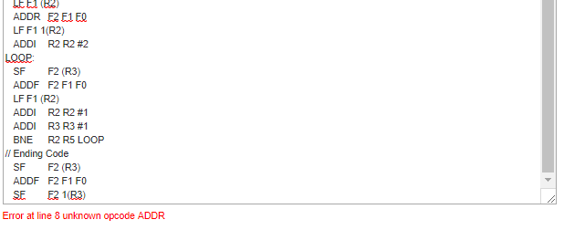

SIMDE permite cargar un código secuencial que puede ser definido por cualquier editor de textos. Este código puede ser introducido directamente en la aplicación a través de un campo de texto o cargado directamente desde un fichero con extensión .pla.

## Características

El código debe cumplir las siguientes características:
* La primera línea (que no sea un comentario) contiene el número de instrucciones del fichero (es decir, no cuentan las líneas en blanco ni las líneas de comentarios, ni las líneas de etiquetas).
* Cada instrucción debe ponerse en una nueva línea.
* Se permiten como separadores de operandos tabuladores o espacios.
* Las etiquetas se ponen al principio de la línea y deben terminar con ":".
* Los comentarios se indican con  "//". De ahí al final de la línea todo es un comentario.

## Instrucciones

Las instrucciones permitidas están inspiradas en el repertorio MIPS IV. Se emplea la siguiente nomenclatura:

* Rn Registro de Propósito General n. 
	Ej.  R1, R0...
* Fm Registro de Punto Flotante m. 
	Ej.  F1, F0...
* \#n Valor inmediato n. 
	Ej.  #12, #0...
* n(Rm) Dirección de memoria. 
	Ej.  (R1), 3(R4)...
* LAB: Etiqueta destino de un salto. 
	Ej.  LOOP1:, END:...

En la [siguiente sección](./instruction-set.md) se recogen, en una tabla, los distintos tipos de instrucciones disponibles.

## Ejemplo de código secuencial


// SIMDE v0.1
// Autor: Iván Castilla Rodríguez
// Utilidad: Programa de testeo de SIMDE
// Comentarios: El programa presupone q 
// en la posición 50 (R2) de memoria tienes un vector de
// 5 elementos y quieres sumar a cada elemento 
// una cantidad fija (en la posición de memoria
// 40). El resultado se coloca a partir 
// de la posición 70 (R3) de memoria.
11
	ADDI	R2 R0 #50
	ADDI	R3 R0 #70
	ADDI	R4 R0 #40
	LF		F0 (R4)
	ADDI	R5 R2 #5
LOOP:
	LF 		F1 (R2)
	ADDF	F1 F1 F0
	SF		F1 (R3)
	ADDI 	R2 R2 #1
	ADDI	R3 R3 #1
	BNE		R2 R5 LOOP


## Gestión de errores

En caso de que el código contenga algún error, este se indicará debajo del formulario. El analizador sintáctico del simulador se detendrá una vez que en encuentre el primer error, con lo cual el primer error puede enmascarar otros.

